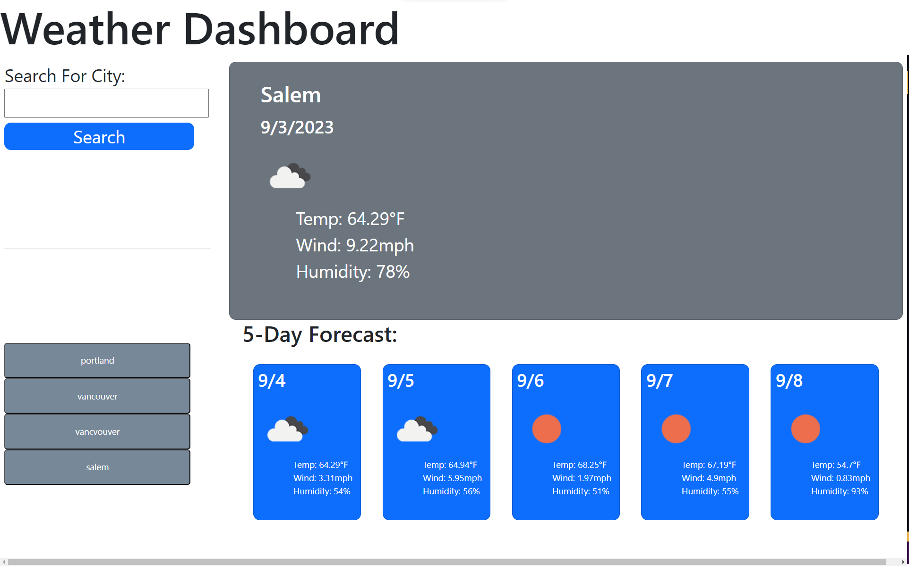

# Weather Dashboard Challenge

##  Project Description
This weather dashbpard application is used to see the weather for a specific location. When the user types in a city in the search field, the site will show 
the current weather anad the 5 day forecast. The recently searched citys are saved to local storage and lister below the search area. The website features a white background with a grey area displaying the specific day. Below the specific day is a 5 day forecast showing the next 5 days of weather.

### Contents

1. [Deployed Page](#deployed-page)
2. [Reference](#reference)

### Deployed Page
[Deployed Website via Github Pages](https://neuroventure.github.io/weather-dashboard/)

### Reference

I used the following resources to help complete this assignment.
+ [MDN Web Docs](https://developer.mozilla.org/en-US/)
+ [W3 Schools](https://www.w3schools.com/)
+ [Chat GPT](https://chat.openai.com/)
+ [Google](google.com)
